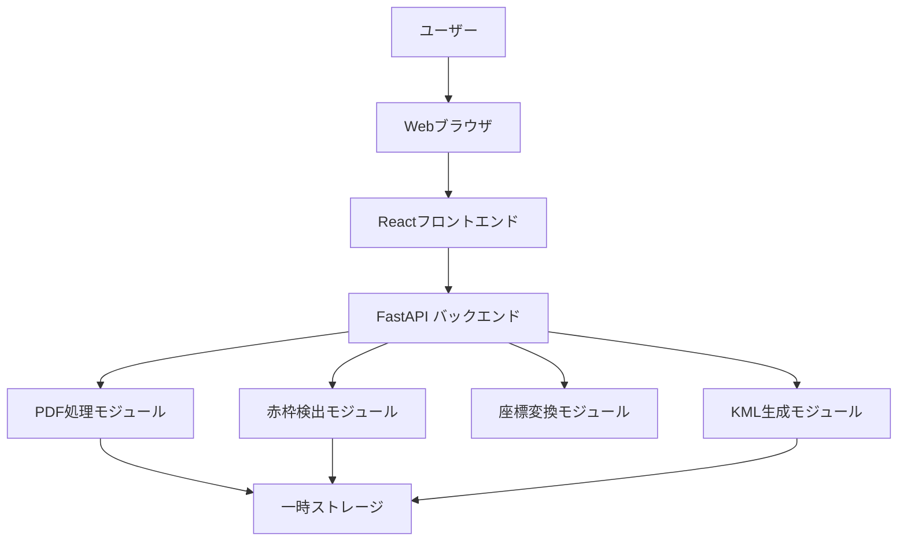

# 設計書

## 概要

PDF赤枠KML変換システムは、Webアプリケーションとして実装されます。ユーザーはブラウザを通じてPDF画像をアップロードし、対話型地図を使用して地理参照点を設定し、検出された赤枠の緯度経度を含むKMLファイルを生成できます。

### 技術スタック

**フロントエンド:**
- React（UIフレームワーク）
- Leaflet（オープンソース地図ライブラリ）
- Axios（HTTP通信）
- Canvas API（画像表示と赤枠プレビュー）

**バックエンド:**
- Python 3.10+
- FastAPI（Webフレームワーク）
- pdf2image（PDF→画像変換）
- OpenCV（画像処理と赤枠検出）
- NumPy（座標変換計算）
- simplekml（KMLファイル生成）

**インフラ:**
- Docker（コンテナ化）
- Nginx（リバースプロキシ）

## アーキテクチャ

### システム構成図



### データフロー

1. **PDFアップロード**: ユーザー → フロントエンド → バックエンド → PDF処理
2. **赤枠検出**: PDF処理 → 画像変換 → 赤枠検出 → 結果返却
3. **基準点設定**: ユーザー（地図クリック + PDF画像クリック） → フロントエンド → 座標記録
4. **座標変換**: 基準点データ → アフィン変換計算 → 赤枠座標変換
5. **KML生成**: 変換済み座標 → KMLファイル生成 → ダウンロード

## コンポーネントと インターフェース

### フロントエンドコンポーネント

#### 1. FileUploadComponent
**責務**: PDFファイルのアップロード

**Props:**
- `onUploadSuccess: (fileId: string, imageUrl: string) => void`
- `onUploadError: (error: string) => void`

**状態:**
- `uploading: boolean`
- `progress: number`

**API呼び出し:**
- `POST /api/upload` - PDFファイルをアップロード

#### 2. PDFViewerComponent
**責務**: PDF画像の表示と基準点の設定

**Props:**
- `imageUrl: string`
- `referencePoints: ReferencePoint[]`
- `onPointClick: (x: number, y: number) => void`
- `detectedBoxes: DetectedBox[]`
- `selectedBoxes: string[]`
- `onBoxToggle: (boxId: string) => void`

**状態:**
- `scale: number` (ズームレベル)
- `panOffset: {x: number, y: number}`

**機能:**
- Canvas上にPDF画像を描画
- クリック位置を取得して基準点として記録
- 検出された赤枠を重ねて表示
- 赤枠の選択/選択解除

#### 3. MapComponent
**責務**: 対話型地図の表示と緯度経度の取得

**Props:**
- `onLocationSelect: (lat: number, lng: number) => void`
- `markers: MapMarker[]`

**状態:**
- `center: {lat: number, lng: number}`
- `zoom: number`

**機能:**
- Leaflet地図の表示
- クリック位置の緯度経度を取得
- 設定済み基準点をマーカー表示

#### 4. ReferencePointManager
**責務**: 基準点の管理と表示

**Props:**
- `referencePoints: ReferencePoint[]`
- `onPointDelete: (index: number) => void`
- `onPointEdit: (index: number, point: ReferencePoint) => void`

**状態:**
- `editingIndex: number | null`

**機能:**
- 基準点リストの表示
- 基準点の編集・削除
- 手動での緯度経度入力

#### 5. ResultPreviewComponent
**責務**: 変換結果のプレビューと KML生成

**Props:**
- `transformedBoxes: TransformedBox[]`
- `mapScale: number`
- `onGenerateKML: () => void`

**状態:**
- `generating: boolean`

**API呼び出し:**
- `POST /api/generate-kml` - KMLファイルを生成

### バックエンドモジュール

#### 1. PDFProcessorModule
**責務**: PDFファイルの処理と画像変換

**クラス: PDFProcessor**

```python
class PDFProcessor:
    def convert_pdf_to_image(self, pdf_path: str, dpi: int = 300) -> str:
        """PDFを画像に変換"""
        pass
    
    def get_image_dimensions(self, image_path: str) -> tuple[int, int]:
        """画像のサイズを取得"""
        pass
```

**API エンドポイント:**
- `POST /api/upload`
  - リクエスト: `multipart/form-data` (PDFファイル)
  - レスポンス: `{file_id: str, image_url: str, width: int, height: int}`

#### 2. RedBoxDetectorModule
**責務**: 赤枠の検出

**クラス: RedBoxDetector**

```python
class RedBoxDetector:
    def detect_red_boxes(self, image_path: str) -> list[DetectedBox]:
        """赤枠を検出"""
        pass
    
    def _detect_thick_red_borders(self, image: np.ndarray) -> list[Box]:
        """濃い赤枠を検出"""
        pass
    
    def _detect_filled_red_areas(self, image: np.ndarray) -> list[Box]:
        """薄い赤の塗りつぶし領域を検出"""
        pass
```

**検出アルゴリズム:**

1. **濃い赤枠の検出:**
   - HSV色空間に変換
   - 赤色範囲でマスク作成（H: 0-10, 170-180, S: 120-255, V: 120-255）
   - モルフォロジー処理（CLOSE→OPEN→DILATE）でギャップを閉じてノイズ除去
   - 輪郭検出（findContours）
   - 多角形近似（approxPolyDP、epsilon=0.01）
   - フィルタリング:
     - 最小面積: 500ピクセル
     - 最小周囲長: 50ピクセル
     - 頂点数: 3〜50
     - Compactness（4πA/P²）≥ 0.01（線状の細長い領域を除外）

2. **薄い赤の塗りつぶし領域の検出:**
   - HSV色空間に変換
   - 薄い赤色範囲でマスク作成（H: 0-10, 170-180, S: 30-120, V: 180-255）
   - モルフォロジー処理（CLOSE→OPEN）で穴を埋めてノイズ除去
   - 輪郭検出
   - 多角形近似（approxPolyDP、epsilon=0.01）
   - 同様のフィルタリング基準を適用

3. **重複除外:**
   - 面積の大きい順にソート
   - IoU（Intersection over Union）> 50%の重複領域を除外
   - 中心点や頂点の包含関係をチェック

**注意:** 赤枠は長方形だけでなく、細かい多角形（3〜50頂点）として検出されます。小さすぎる領域や線状の領域は自動的に除外されます。

**API エンドポイント:**
- `POST /api/detect-boxes`
  - リクエスト: `{file_id: str}`
  - レスポンス: `{boxes: list[DetectedBox], count: int}`

**DetectedBox型:**
```python
class DetectedBox(BaseModel):
    id: str
    corners: list[Point]  # 多角形の頂点座標（ピクセル）- 3頂点以上
    center: Point
    box_type: str  # "thick_border" or "filled_area"
```

#### 3. GeoTransformModule
**責務**: 座標変換の計算

**クラス: GeoTransformer**

```python
class GeoTransformer:
    def calculate_affine_matrix(
        self, 
        image_points: list[Point], 
        geo_points: list[GeoPoint]
    ) -> np.ndarray:
        """アフィン変換行列を計算"""
        pass
    
    def validate_reference_points(
        self, 
        points: list[Point]
    ) -> tuple[bool, str]:
        """基準点の配置を検証（共線性チェック）"""
        pass
    
    def transform_point(
        self, 
        point: Point, 
        matrix: np.ndarray
    ) -> GeoPoint:
        """画像座標を緯度経度に変換"""
        pass
    
    def estimate_map_scale(
        self, 
        image_points: list[Point], 
        geo_points: list[GeoPoint],
        image_dpi: int
    ) -> float:
        """地図の縮尺を推定"""
        pass
```

**座標変換アルゴリズム:**

1. **アフィン変換行列の計算:**
   - 最小二乗法を使用
   - 3点以上の基準点から6パラメータを計算
   - 変換式: `[lng, lat] = A * [x, y] + b`

2. **共線性チェック:**
   - 3点の外積を計算
   - 閾値以下なら警告

3. **縮尺推定:**
   - 基準点間の画像上の距離（ピクセル）を計算
   - 基準点間の実際の距離（メートル）を計算（Haversine公式）
   - 縮尺 = 実距離 / (画像距離 * DPI / 25.4)

**API エンドポイント:**
- `POST /api/transform`
  - リクエスト: `{file_id: str, reference_points: list[ReferencePoint], boxes: list[str]}`
  - レスポンス: `{transformed_boxes: list[TransformedBox], map_scale: float, warnings: list[str]}`

#### 4. KMLGeneratorModule
**責務**: KMLファイルの生成

**クラス: KMLGenerator**

```python
class KMLGenerator:
    def generate_kml(
        self, 
        boxes: list[TransformedBox], 
        filename: str
    ) -> str:
        """KMLファイルを生成"""
        pass
    
    def _create_polygon(
        self, 
        kml: simplekml.Kml, 
        box: TransformedBox
    ) -> None:
        """Polygon要素を作成"""
        pass
```

**KML構造:**
```xml
<?xml version="1.0" encoding="UTF-8"?>
<kml xmlns="http://www.opengis.net/kml/2.2">
  <Document>
    <name>PDF Red Boxes</name>
    <Placemark>
      <name>Box 1</name>
      <Polygon>
        <outerBoundaryIs>
          <LinearRing>
            <coordinates>
              lng1,lat1,0
              lng2,lat2,0
              lng3,lat3,0
              lng4,lat4,0
              lng1,lat1,0
            </coordinates>
          </LinearRing>
        </outerBoundaryIs>
      </Polygon>
    </Placemark>
  </Document>
</kml>
```

**API エンドポイント:**
- `POST /api/generate-kml`
  - リクエスト: `{file_id: str, boxes: list[TransformedBox]}`
  - レスポンス: `{download_url: str, filename: str}`

## データモデル

### フロントエンド型定義（TypeScript）

```typescript
interface Point {
  x: number;
  y: number;
}

interface GeoPoint {
  lat: number;
  lng: number;
}

interface ReferencePoint {
  imagePoint: Point;
  geoPoint: GeoPoint;
  id: string;
}

interface DetectedBox {
  id: string;
  corners: Point[];
  center: Point;
  boxType: 'thick_border' | 'filled_area';
}

interface TransformedBox {
  id: string;
  corners: GeoPoint[];
  center: GeoPoint;
}

interface MapMarker {
  position: GeoPoint;
  label: string;
}
```

### バックエンドモデル（Pydantic）

```python
from pydantic import BaseModel, Field
from typing import List

class Point(BaseModel):
    x: float
    y: float

class GeoPoint(BaseModel):
    lat: float = Field(ge=-90, le=90)
    lng: float = Field(ge=-180, le=180)

class ReferencePoint(BaseModel):
    image_point: Point
    geo_point: GeoPoint
    id: str

class DetectedBox(BaseModel):
    id: str
    corners: List[Point]
    center: Point
    box_type: str

class TransformedBox(BaseModel):
    id: str
    corners: List[GeoPoint]
    center: GeoPoint

class UploadResponse(BaseModel):
    file_id: str
    image_url: str
    width: int
    height: int

class DetectionResponse(BaseModel):
    boxes: List[DetectedBox]
    count: int

class TransformRequest(BaseModel):
    file_id: str
    reference_points: List[ReferencePoint]
    boxes: List[str]  # box IDs

class TransformResponse(BaseModel):
    transformed_boxes: List[TransformedBox]
    map_scale: float
    warnings: List[str]

class KMLRequest(BaseModel):
    file_id: str
    boxes: List[TransformedBox]

class KMLResponse(BaseModel):
    download_url: str
    filename: str
```

## エラーハンドリング

### エラー分類

1. **バリデーションエラー（400 Bad Request）**
   - 無効なファイル形式
   - 基準点が3つ未満
   - 緯度経度の範囲外
   - 共線性エラー

2. **処理エラー（500 Internal Server Error）**
   - PDF変換失敗
   - 画像処理エラー
   - ファイルI/Oエラー

3. **リソースエラー（404 Not Found）**
   - ファイルIDが存在しない

### エラーレスポンス形式

```python
class ErrorResponse(BaseModel):
    error: str  # エラーの種類
    message: str  # 日本語のエラーメッセージ
    details: str  # 詳細情報
    suggestion: str  # 推奨される対処方法
```

### エラーメッセージ例

```python
ERROR_MESSAGES = {
    "invalid_file_format": {
        "message": "アップロードされたファイルはPDF形式ではありません",
        "suggestion": "PDFファイルを選択してください"
    },
    "insufficient_reference_points": {
        "message": "基準点が不足しています（現在: {count}個）",
        "suggestion": "最低3つの基準点を設定してください"
    },
    "collinear_points": {
        "message": "基準点が一直線上に配置されています",
        "suggestion": "基準点を三角形状に配置してください"
    },
    "no_boxes_detected": {
        "message": "赤枠が検出されませんでした",
        "suggestion": "PDF画像に赤枠が含まれているか確認してください"
    }
}
```

### ログ記録

```python
import logging

logger = logging.getLogger(__name__)

# ログレベル
# - INFO: 正常な処理フロー
# - WARNING: 警告（処理は継続）
# - ERROR: エラー（処理失敗）
# - CRITICAL: システムエラー

# ログ形式
# [timestamp] [level] [module] [message] [context]
```

## テスト戦略

### 単体テスト

**フロントエンド（Jest + React Testing Library）:**
- 各コンポーネントの描画テスト
- ユーザーインタラクションのテスト
- 状態管理のテスト

**バックエンド（pytest）:**
- 各モジュールの機能テスト
- エッジケースのテスト
- エラーハンドリングのテスト

### 統合テスト

- API エンドポイントのテスト
- ファイルアップロード→検出→変換→KML生成の一連のフロー

### E2Eテスト（Playwright）

- ユーザーシナリオのテスト
  1. PDFアップロード
  2. 赤枠検出確認
  3. 基準点設定（3点）
  4. 座標変換実行
  5. KMLダウンロード

### テストデータ

- サンプルPDFファイル（赤枠あり/なし）
- 既知の座標を持つテスト画像
- 期待されるKML出力

## セキュリティ考慮事項

1. **ファイルアップロード:**
   - ファイルサイズ制限（最大50MB）
   - ファイル形式検証（MIMEタイプチェック）
   - ウイルススキャン（オプション）

2. **一時ファイル管理:**
   - アップロードファイルは一時ディレクトリに保存
   - セッション終了後に自動削除（TTL: 1時間）
   - ファイル名のサニタイズ

3. **CORS設定:**
   - 許可されたオリジンのみアクセス可能

4. **レート制限:**
   - API呼び出しの頻度制限

## パフォーマンス最適化

1. **画像処理:**
   - 大きな画像はリサイズ（最大4000x4000ピクセル）
   - 非同期処理（Celery/RQ）

2. **フロントエンド:**
   - 画像の遅延読み込み
   - Canvas描画の最適化

3. **キャッシング:**
   - 検出結果のキャッシュ
   - 変換結果のキャッシュ

## デプロイメント

### Docker構成

```yaml
# docker-compose.yml
version: '3.8'
services:
  frontend:
    build: ./frontend
    ports:
      - "3000:3000"
  
  backend:
    build: ./backend
    ports:
      - "8000:8000"
    volumes:
      - ./temp:/app/temp
    environment:
      - UPLOAD_DIR=/app/temp
  
  nginx:
    image: nginx:alpine
    ports:
      - "80:80"
    volumes:
      - ./nginx.conf:/etc/nginx/nginx.conf
```

### 環境変数

```
# Backend
UPLOAD_DIR=/app/temp
MAX_FILE_SIZE=52428800  # 50MB
FILE_TTL=3600  # 1 hour
LOG_LEVEL=INFO

# Frontend
REACT_APP_API_URL=http://localhost:8000
REACT_APP_MAP_PROVIDER=leaflet
```
